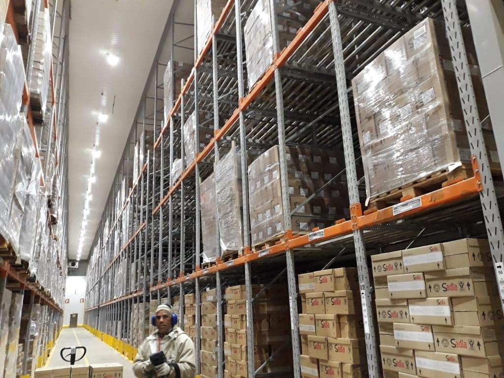

# Inventory Management Using Barcode Object Detection at the Edge and Processing in the Cloud 

[Google Slides Presentation](https://docs.google.com/presentation/d/1FRjIWfndb2lnhH-SsvAbXP488v1PZY7sP5-6IJmCs_Y/edit?usp=sharing)

## Table of Contents

**[1. Introduction](#Introduction)**
* **[Problem Statement](#Problem-Statement)**
* **[Proposed Solution](#Proposed-Solution)**

**[2. Training Data](#Training-Data)**  
**[3. The Edge](#The-Edge)**
* **[OpenCV](#OpenCV)**
* **[YOLOv5](#YOLOv5)**
    * **[YOLO Training](#YOLO-Training)**
    * **[YOLO Inference](#YOLO-Inference)**
      * **[NVIDIA Jetson](#NVIDIA-Jetson)**
      * **[iPhone iOS](#iPhone-iOS)**

**[4. Messaging Service](#Messaging-Service)**

**[5. The Cloud](#The-Cloud)**

**[6. Architectural Diagram](#Architectural-Diagram)**

**[7. Next Steps](#Next-Steps)**

___

## Introduction

### **Problem Statement**

A large food and beverage company owns hundreds of warehouses each with thousands of square feet of storage space. These distribution centers are packed full of different pallets, each containing valuable food products that will be shipped across the globe. Keeping track of the location and content of each shipping container is a seemingly impossible task. Currently, a manual inventory is conducted multiple times a week to ensure that the quantity and location of containers is accurate and up-to-date. This manual inventory requires many hours of labor and is prone to human error in the counting and location of products.

<p align="center">

</p>
<p align = "center">
Figure 1: Food Company Distribution Center
</p>


### **Proposed Solution**

We propose an object detection machine learning system that can conduct real time inventory on the shipping containers. This system will completely eliminate the manual labor and human error that occurs during inventory. 

Our proposed system will capture an image of a pallet's label either through the use of stationary camera or cell phone. Once the image is captured it will use a customized barcode detection model to locate and crop the barcode of interest out of the original image. The cropped image will then be sent to AWS where is will by read by a python script. The python script will attempt to read the barcode, store the image in an AWS S3 buckets, and write a record to a MySQL database. The scanned items can then be seen on a website containing detailed information about the inventory that was scanned.

## Training Data

Creating any type of custom model for barcode detection requires training data. Our team reached out to one of the warehouse's manager and asked if they could provide us with videos of the container labels. They were happy to help with our academic endeavour and provided us short videos of the container labels.

<p align="center">

</p>
<p align = "center">
Figure 2: Sample pallet label with various barcodes
</p>


One of the first things our team noticed was that the container labels had multiple barcodes. We determined that the bottom most barcode was the one that contained information about the contents of the container. Once we knew what barcode we were tying to identify we used [ffmpeg](https://www.ffmpeg.org/) to capture 300 still images from the videos that we could use for training our models. We also used [makesense.ai](https://www.makesense.ai/) to annotate the bottom most barcode so that it could be used for training one of our models.

<p align="center">

</p>
<p align = "center">
Figure 3: Sample pallet label showing barcode on interest
</p>

## The Edge

We have two edge devices capable of detecting barcode images. A stationary camera (Jetson Webcam) and a cell phone. The idea is that stationary cameras could be placed strategically inside the warehouse to conduct real time inventory checks or cell phones could be used by associates to scan images when stationary cameras would not be effective. Models run on the stationary cameras are containerized in docker for easy portability and to reduce compatibility issues.

We trained two different models that would work on a stationary camera.

### **OpenCV**
Using the C++ version of OpenCV we created a cascade.xml file trained to detect the barcode of interest. Following the [coding robin](https://coding-robin.de/2013/07/22/train-your-own-opencv-haar-classifier.html) tutorial and utilizing the code in [opencv-haar-classifier-training](https://github.com/mrnugget/opencv-haar-classifier-training) github repository allowed us to create an OpenCV haar classifier specifically trained to locate the barcode of interest. This classifier was trained using about 300 barcode images that were generated using the process discussed in the "Obtaining Training Data" of this project. The high level steps for creating a haar classifier are:

Gather both positive and negative images. Positive images are images containing only the object of interest in this case the barcode. Negative images are images that do not contain the object of interest (barcode).  Getting positive images required us to crop all 300 bardcodes out of there original images.

<p align="center">

</p>
<p align = "center">
Figure 4: Sample positive image used to train the OpenCV Cascade file
</p>
  
As for negative images we chose to use images from an [imagenet bird dataset](https://www.kaggle.com/c/midsw251birds/data) since we are confident that there are no barcodes in any of these images.

Once we have our positive an negative images we create sample images that superimpose our positive images (barcodes) over our negative images (birds). The OpenCV function `opencv_traincascade` uses these sample images and an adaboost model to train an image detection classifier.

<p align="center">

</p>
<p align = "center">
Figure 5: Sample superimposed image to train the OpenCV Cascade file
</p>


We trained our classifier on a Jetson device for 21 epochs using 300 positive images and 600 negative images. This process took about 36 hours. Once our model were trained we had successfully created a cascade.xml file that could be used by OpenCV to detect our barcode of interest in a live video stream.

### **YOLOv5**

Our method for detecting the pallet barcodes leveraged Ultralytics YOLOv5 architecture. YOLO, "You Only Look Once," has a long and successful history with real-time object detection. It is a family of object detection architectures and models pre-trained on the COCO dataset.  It represents Ultralytcs open-source research into future vision AI methods, a result that stemmed from incorporating lessons learned and best practices evolved over thousands of hours of research and development. 

#### **YOLO Training**

The first step to be able to use YoloV5 for inference is to train a model using annotated images. This was done using 300 annotated images from  [MakeSenseAI](https://www.makesense.ai/) and feeding them into [RoboFlow](https://roboflow.com/). Roboflow takes in images annotated in COCO format and can prepare the data to be used within the YOLOv5 architecture. It also splits the data into Training and Test datasets. Once this is completed, the data can be easily imported into the YOLOv5 code for training. We initially ran 20 epochs, but the mAP values did not stabilize. When we increased the number of epochs to 100, the results improved significantly, as can be seen in the picture below.

<p align="center">

</p>
<p align = "center">
Figure 6: mAP results from YOLOv5 Training over 100 epochs
</p>

This YOLOv5 training effort output a file called 'best.pt', which contains the weights to be used for inference via the detect.py file described below. 

#### **YOLO Inference**  
##### **NVIDIA Jetson**
In order to utilize the YOLOv5 architecture, we started by creating a docker container for the Jetson Xavier NX.  NIVIDA's PyTorch container (nvcr.io/nvidia/l4t-pytorch:r32.5.0-pth1.6-py3) is a docker image that contains PyTorch and torchvision frameworks pre-installed in a Python 3.6 environment.  The container supports the JetPack firmware installed on our NVIDIA GPU.  Next, we installed several packages and tools like OpenCV, GStreamer, scikit-build, etc.  The container build time took roughly two hours.  Prior to starting the container, connect a webcam--this serves as our vision detection device.  Once the container build was complete and the webcam connected, we invoked the container with a series of options (see code snippet below).  Notice the command incorporates the model that we trained from the barcode images.  The layers of the neural network are fused upon startup to accommodate the two classes.  Now the GPU and webcam are ready to classify images. 

```
docker run -it --rm \ # run in interactive mode
           --runtime nvidia \ # enable GPU accelerated runtime
           --network host \ # specify host network
           --device /dev/video0:/dev/video0:mrw \ # access video device
           -e DISPLAY=$DISPLAY \ # set display to system display
           -v /tmp/.X11-unix/:/tmp/.X11-unix \ # mount X server socket
           -v /models/w251-final-project:/weights \ # mount model directory
           yolov5 python3 detect.py \ # run detection
           --save-crop \ # save cropped images of the barcode
           --save-txt \  # save the (x,y) position of the barcode in the frame
           --conf-thres 0.60 \ # use a confidence threshold of 0.60
           --source 0 \ # webcam as source
           --weights /weights/best.pt # use trained model
```
<p align = "center">
Code 1 : YOLOv5 Docker deployment steps
</p>
</br>

Barcode recognition from a live stream produced excellent results--to our enthusiasm.  Aside from the live stream, we passed other sources such as still images and videos into the classification algorithm.  All sources were successful, thereby leaving several options for future implementations.  Cropping barcodes from photos, videos, and live streams achieved the team's goal; we are satisfied with the result.   

<p align="center">

</p>
<p align = "center">
Figure 7: YOLOv5 inference on pre-recorded video
</p>
</br>


<p align="center">

</p>
<p align = "center">
Figure 8: YOLOv5 inference on streaming webcam video
</p>  

##### **iPhone iOS**  
While our cell phone image detection used the same YOLO model just deployed to an iOS device.

## Messaging service

Once our models identify a barcode we crop the barcode of interest, encode it using base64encode and send it and through our MQTT (Mosquitto) service.

Our MQTT service has one topic connecting all our edge device containers to the cloud. We chose MQTT since it is the industry standard messaging service for IOT devices.

## The Cloud

Our cloud infrastructure is comprised of four docker containers that share a network due to the fact that they are started using the same docker-compose file.

The cropped image is first sent to the container housing the MQTT broker. The broker works with a python container to receive the image. The python container then converts the encoded image to a PNG file. A python package called [pyzbar](https://github.com/NaturalHistoryMuseum/pyzbar/) then attempts to read the barcode from the image. Next the image is saved to an Amazon S3 bucket. If the image is successfully read by pyzbar the barcode number and the S3 url are saved to another container housing a MySQL database. If the barcode can not be read only the S3 URL is saved to MySQL. Once the image has been saved to S3 and the record has been written to the MySQL database the original image is deleted.

The fourth container in AWS is a apache-php container. This container works as a webserver allowing us to display the information in the MySQL container as a webpage. The final results of the inventory can be viewed on a web page [here](http://52.71.238.26/) to ensure the results are accurate and consistent. If a barcode could not be read by the python package pyzbar a link to the scanned image using the words "Manual Review" will be display on the webpage. This will allow the user to conduct a manual review of the image that was scanned to enter the barcode information into the system manually.

## Architectural Diagram

<p align="center">

</p>
<p align = "center">
Figure 9: Overall architecture diagram
</p>


## Next Steps

Currenly, the project is limited to the recognition and record storage of barcode label.  In order to fully satisfy the problem statement, we would need to design and implement a type of mesh network of cameras with our object recognition model and cloud architecture deployed.  This would automate the record-keeping as pallets entered the warehouse.  Finally, we would then need to incorporate the capability for the system to infer where in the warehouse each pallet is stored and log when a pallet is removed from the warehouse.
